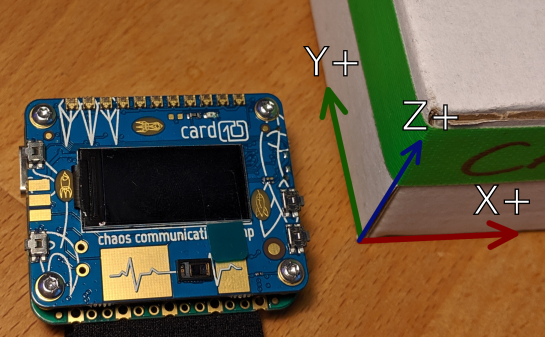

.. py:module:: bhi160

``bhi160`` - Sensor Fusion
==========================

.. versionadded:: 1.4

Supports the BHI160 sensor on the card10 for accelerometer, gyroscope,
magnetometer and orientation.

The coordinate system of the BHI160 sensor data looks like this:

* The **accelerometer** axes are just the ones shown in the picture.
* The **gyroscope**'s angular velocities rotate counter clockwise around
  their respective axis.
* The **orientation** sensor uses the following mapping:

  +---------------------+----------------------+-------------------+
  | X                   | Y                    | Z                 |
  +=====================+======================+===================+
  | Azimuth (0° - 360°) | Pitch (-180° - 180°) | Roll (-90° - 90°) |
  +---------------------+----------------------+-------------------+

**Example**:

.. code-block:: python

   import bhi160
   import utime

   bhi = bhi160.BHI160Orientation()

    while True:
        samples = bhi.read()
        if len(samples) == 0:
            utime.sleep(0.25)
            continue
        # print the latest sample
        print(samples[-1])
        utime.sleep(0.25)

Orientation
-----------
.. autoclass:: bhi160.BHI160Orientation
   :members:
   :inherited-members:

Accelerometer
-------------
.. autoclass:: bhi160.BHI160Accelerometer
  :members:
  :inherited-members:

Gyroscope
---------
.. autoclass:: bhi160.BHI160Gyroscope
  :members:
  :inherited-members:

Magnetometer
------------
.. autoclass:: bhi160.BHI160Magnetometer
  :members:
  :inherited-members:
